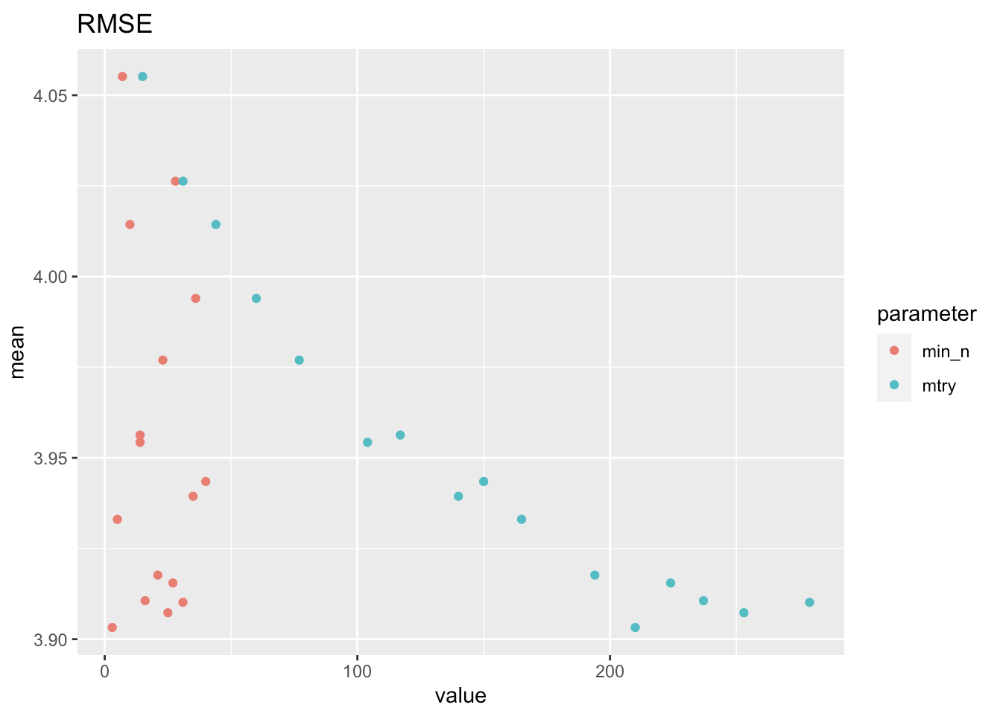
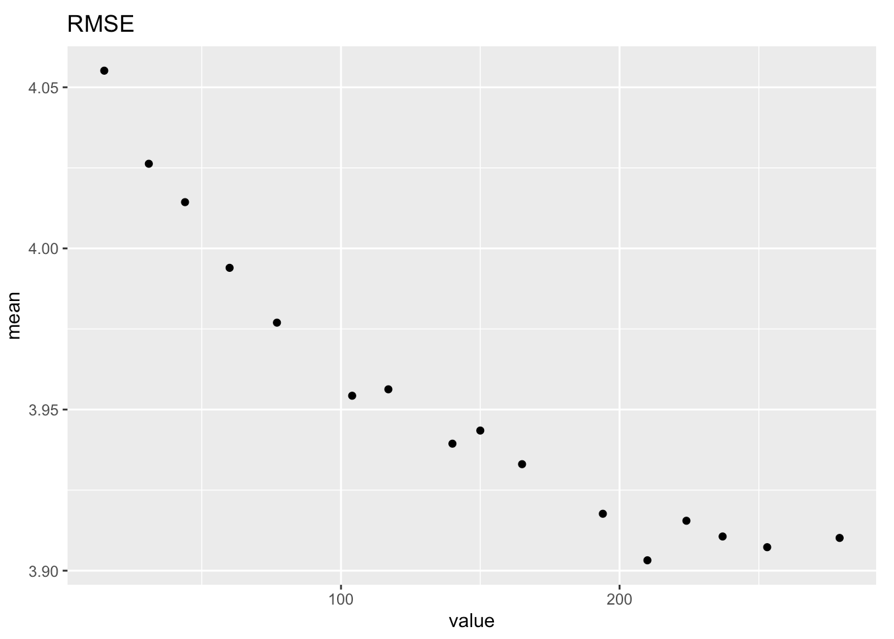

```{r include = FALSE}
def.chunk.hook <- knitr::knit_hooks$get("chunk")
knitr::opts_chunk$set(cache = FALSE)
knitr::knit_hooks$set(
  chunk = function(x, options) {
    x <- def.chunk.hook(x, options)
    ifelse(options$size != "normalsize", paste0("\n \\", options$size, "\n\n", x, "\n\n \\normalsize"), x)
  }
)
# knitr::knit_hooks$set(inline = function(x) {
#   prettyNum(round(x, 2), big.mark = ",")
# })
options(scipen=999)
```

\begin{center}
\Huge{PPOL 670 | Final Project}

\Huge{Random Forest}
\end{center}

\vspace{0.1in}

## Setup

```{r setup, message=FALSE}
library(tidyverse)
library(tidymodels)
library(recipes)
library(vip)
library(lubridate)
library(workflows)
library(ranger)
source("times.R")
source("io.R")
source("manipulate_data.R")
doParallel::registerDoParallel()
```

## Why this algorithm 

Random forests works well with large datasets like the one we are using in our project which contain over 12k observations and up to 700 variables. It also can have an extremely high accuracy in its predictions and it scales well in general and compared to decision trees.

## How Random Forests Work

Random forests build n decision tree regressors, following specified parameters optimized by implementing hyperparameter tunning (more on this shortly). Predictions are made using attribute selection, where each decision tree works on defining the attributes and their values which would determine the “best split”. The objective is to choose the split that will minimize the error cost (MSE). We use mtry in our hyperparameter tuning to decide on number of variables randomly sampled as candidates at each split (essentially avoids overfitting).This process keeps repeating until either the leaf nodes reach all samples, or as in our case, there is a stopping criteria (maximum depth of the tree). To define this stopping criteria we use  min_n to optimize the number of observations needed to keep splitting nodes (the larger the tree, the more it become computationally expensive). 

Finally, Random forests averages predictions estimated by all decision trees in the model to get the ‘final’ prediction 

## Preparing the data

We tried 1600m, 3200m, and 5000m. 5000m was the best, but took too long to run (3.59). 3200m was very close (0.07 RMSE difference). 1600m showed significant degradation (0.29 RMSE difference).

```{r get_data, cache=TRUE}
  
lagged_data <- read_csv('lagged_data_3200.csv')

model_data <- lagged_data %>%
  add_predictor_times() %>%
  filter(!is.na(departures) & !is.na(arrivals)) %>%
  # Having real time arrival data would be cheating
  select(-arrivals) %>% 
  format_weather()

```


```{r setup_data, cache=TRUE}

set.seed(28021995)

# create a split object
data_split <- initial_split(model_data, prop = 0.8)

# create the training and testing data
train <- training(x = data_split)
test  <- testing(x = data_split)

folds <- vfold_cv(data = train, v = 10)

```


## Our preprocessing for Random Forests is the same as decision trees because Random Forests is just a "more complex" decision tree.

## Implementation


```{r recipe, cache=TRUE}
recipe <-
  recipe(formula = departures ~ ., data = train) %>%
  step_holiday(date, holidays = timeDate::listHolidays("US"), keep_original_cols = FALSE) %>% 
  step_nzv(all_predictors()) %>% # aaron suggested adding this
  step_BoxCox(all_outcomes())  ## only works with positive vars, no problem in our case
```

## Tuning

We tuned for `min_n`, `trees`, and `mtry` at different times.

```{r tuning, cache=TRUE}
mod <- rand_forest(mtry = 250, trees = tune()) %>% # we should have anywhere between 100 and 1000 trees
  set_mode("regression") %>%
  set_engine("ranger")

wf <- workflow() %>%
  add_recipe(recipe) %>%
  add_model(mod)

tune_results <- tune_grid(
  wf,
  resamples = folds,
  grid = 16,
  metrics = metric_set(rmse, mae)
)
```

### Graph results

```{r graphs, eval=FALSE}
metrics <- tune_results %>%
  collect_metrics() %>%
  pivot_longer(trees,
    values_to = "value",
    names_to = "parameter"
  )

metrics %>%
  filter(.metric == "rmse") %>%
  ggplot(aes(x = value, y = mean)) +
  geom_point() +
  labs(title = "RMSE")

metrics %>%
  filter(.metric == "mae") %>%
  ggplot(aes(x = value, y = mean)) +
  geom_point() +
  labs(title = "MAE")

metrics %>%
  filter(.metric == "rmse", parameter == "mtry") %>%
  ggplot(aes(x = value, y = mean)) +
  geom_point() +
  labs(title = "RMSE")

metrics %>%
  filter(.metric == "rmse", parameter == "min_n") %>%
  ggplot(aes(x = value, y = mean)) +
  geom_point() +
  labs(title = "RMSE")
```

### `min_n` and `mtry` tuning



### `mtry` only graph - used 250 in final model



### `min_n` only graph. `min_n` does not seem to matter, used default of 5.


### Tuning for number of trees. Used 1000


## Picking results for tree tuning

```{r ft_results, cache=TRUE}
best_rmse <- tune_results %>%
  select_best("rmse")

best_rmse

best_mae <-tune_results %>%
  select_best("mae")

best_mae

final_rf <- finalize_model(
  mod,
  best_rmse
)

collect_metrics(tune_results, summarize = FALSE) %>%
  filter(.metric == "rmse" || .metric == "mae") %>%
  ggplot(aes(x = id, y = .estimate, group = .estimator)) +
  geom_point(aes(color=.metric)) +
  scale_y_continuous(limits = c(0, 5)) +
  labs(title = "Calculated MAE and RMSE Across the 10 Folds",
     y = "RMSE_hat") +
  theme_minimal()

collect_metrics(tune_results, summarize = FALSE) %>%
  filter(.metric == "rmse") %>%
  summarize(mean(.estimate))
```

```{r chosen_one, cache=TRUE}
final_wf <- workflow() %>%
  add_recipe(recipe) %>%
  add_model(final_rf) %>%
  fit(train)

p_test <- bind_cols(
  test,
  predict(object = final_wf, new_data = test))
```

Out of sample RMSE

```{r OOS_RMSE_lincoln}
sqrt(mean((p_test$departures - p_test$.pred)^2))
```

```{r lincoln_final_vip, warning=FALSE, cache=TRUE}
final_rf %>%
  set_engine("ranger", importance = "permutation") %>%
  fit(departures ~ .,
    data = train
  ) %>%
  vip(geom = "point")
```
